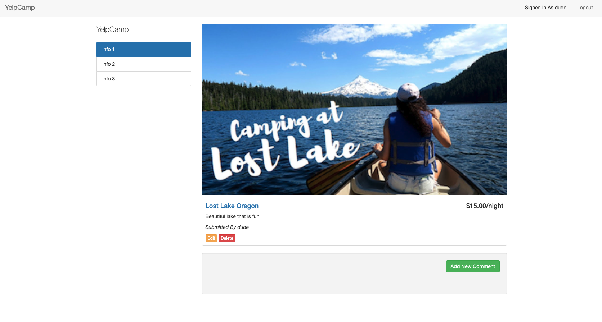

# RESTful Routing

## Description

Fullstack app that allows you to login and store camps sites where you can use full CRUD operations.

## Installation

- `npm install`
- un-comment in app.js line 20 db
- turn on mongod
- mongo
- show dbs
- use yelp_camp
- nodemon app.js

## Tools

- HTML
- Javascript
- MongoDB
- NODE
- Express
- Passport
- REST
- CRUD

## Blog Index

- Setup the Blog App
- Create the Blog model
- Add INDEX route and template

## Basic Layout

- Add Header and Footer Partials
- Include Semantic UI
- Add Simple Nav

## Putting the C in CRUD

- Add NEW route
- Add NEW template
- Add CREATE route
- Add CREATE template

## SHOWtime

- Add Show route
- Add Show template
- Add links to show page
- Style show template

## Edit/Update

- Add Edit Route
- Add Edit Form
- Add Update Route
- Add Update Form
- Add Method-Override

## DESTROYYYYYY

- Add Destroy Route
- Add Edit and Destroy Links

## Final Updates

- Sanitize blog body
- Style Index
- Update REST Table
